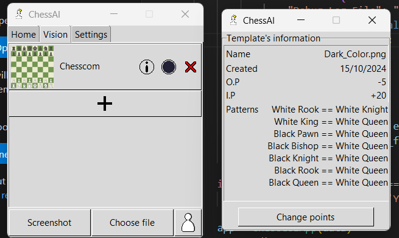

#### v0.2.1

- Thêm thông tin của mẫu và điểm O.P, I.P.

#### v0.2.0

- Cuối cùng, chúng ta cũng có tab vision (vì đang trong dang dở nên sẽ có lỗi).

- Chọn file hoặc chụp màn hình. Sau đó cắt theo ý muốn.

**Lưu ý:** Nền nên có một màu (Không màu gradient) và bạn không nên cắt quá sát. 

- Tạo template theo ý mình

#### v0.1.3

- Có thể 'đi lại' và 'đi lại quá trình đi lại' nước cờ.

#### v0.1.2

- Hiển thị phần sửa đổi ở tab 'Settings'.

#### v0.1.1

- Nước đi tốt nhất dễ nhìn hơn.

#### v0.1.0

- Thiết lập ván cờ bằng cơ chế kéo thả.

- Bàn cơ chơi được.

- Có thể thay đổi elo.

- Có thể chơi Chess960.

