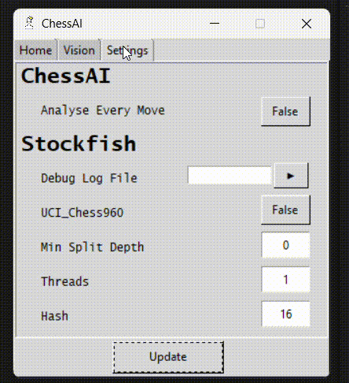
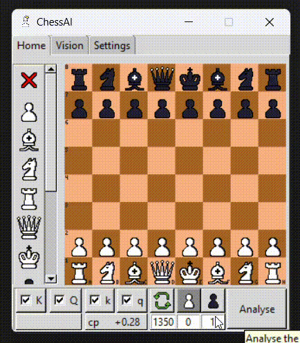
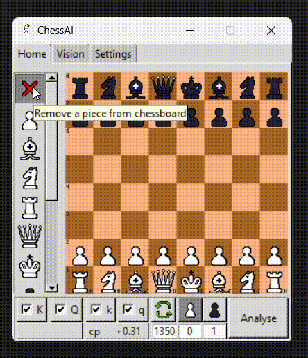
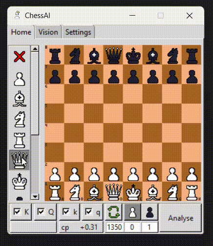
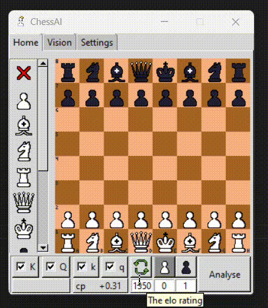
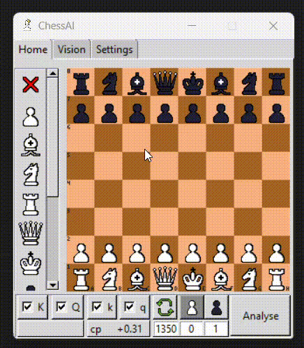

#### v0.1.3

- Changed setting is visible.

#### v0.1.2

- Changed setting is visible.

#### v0.1.1

- Top moves are easier to located.

#### v0.1.0

- Drag&move setup chessboard.

- Playable chessboard.

- Changable elo.

- Able to play Chess960.

