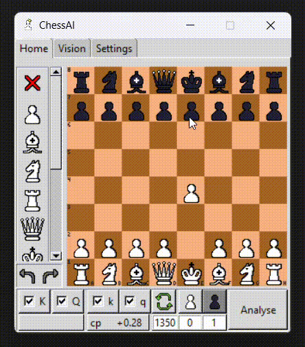

#### v0.2.0

- Finally, we have the vision tab (Still WIP so there will be some errors).

- Choose file or screenshot your chessboard. Then crop it.

**Notice:** The background must one color only (No gradient) and you must not crop it too tight. 

- Make your own custom templates.

#### v0.1.3

- Able to undo and redo move on chessboard.

#### v0.1.2

- Changed setting is visible.

#### v0.1.1

- Top moves are easier to located.

#### v0.1.0

- Drag&move setup chessboard.

- Playable chessboard.

- Changable elo.

- Able to play Chess960.

