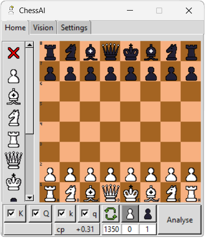
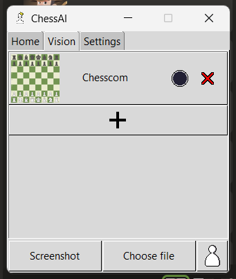
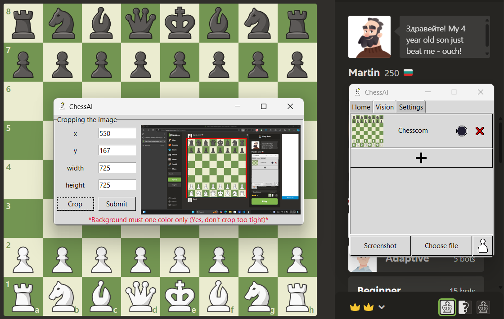
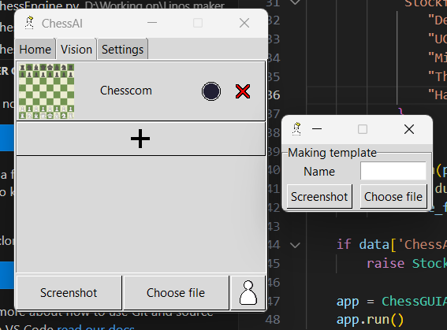

[English](README.md) | [Tiếng Việt](README-vi.md)

<div align="center">

# ChessAI

**AI huỷ diệt cờ vua.**

[![][chessai-shield]][chessai-url]
[![][python-shield]][python-url]
[![][conda-shield]][conda-url]
[![][stockfish-shield]][stockfish-url]

[chessai-shield]: https://img.shields.io/badge/ChessAI-0.2.0-red
[chessai-url]: https://github.com/Linos1391/ChessAI
[python-shield]: https://img.shields.io/badge/Python-3.12+-yellow
[python-url]: https://www.python.org/downloads/
[conda-shield]: https://img.shields.io/badge/Anaconda-24.7+-grass
[conda-url]: https://www.anaconda.com/download
[stockfish-shield]: https://img.shields.io/badge/Stockfish-16+-green
[stockfish-url]: https://stockfishchess.org/download/




Ứng dụng này sẽ hỗ trợ bạn phân tích các nước đi của cờ vua trong cửa sổ phụ.

</div>

## Mục lục

1. [Tính năng](#tính-năng)

2. [Tải xuống](#tải-xuống)

3. [Chuẩn bị Stockfish](#chuẩn-bị-stockfish)

4. [Hoạt động](#hoạt-động)

5. [Giấy phép](#giấy-phép)

6. [Miễn trừ trách nhiệm](#miễn-trừ-trách-nhiệm)

## Tính năng

#### Tính năng mới (v0.2.0):

- Cuối cùng, chúng ta cũng có tab vision (vì đang trong dang dở nên sẽ có lỗi).



- Chọn file hoặc chụp màn hình. Sau đó cắt theo ý muốn.

**Lưu ý:** Nền nên có một màu (Không màu gradient) và bạn không nên cắt quá sát. 



- Tạo template theo ý mình



#### Để xem những tính năng cũ, vào [Change Log](CHANGELOG-vi.md).

## Tải xuống

#### Lựa chọn 1: Tải [file .exe](https://github.com/Linos1391/ChessAI/releases/tag/exe-file).

- Mở file .exe để 'setting.json' được tạo ra tự động. Điều chỉnh file đó và tận hưởng.

**Lưu ý:** Trình duyệt của bạn có thể thông báo rằng file này không thường được tải. Báo cáo sự an toàn của nó sẽ giúp tôi rất nhiều!

#### Lựa chon 2: Tải thủ công thông qua Github:

1. Lưu thư mục về máy.

```
git clone https://github.com/Linos1391/ChessAI.git
cd ChessAI
```

2. Tải những thư viện Python cần thiết.

```
pip install -r requirements.txt
```

## Chuẩn bị Stockfish

1. Đi đến [trang này](https://stockfishchess.org/download/) và tải Stockfish hỗ trợ thiết bị của bạn.
2. Mở file [ChessAI/setting.json](ChessAI/setting.json).
```
{
    "ChessAI": {
        "Engine": "", <-- Cho địa chỉ của Stockfish vào đây (.exe)
        "Analyse Every Move": false,
        "Elo": 1350,
        "Current Template": "Chesscom"
    },
    "Stockfish": {
        "Debug Log File": "",
        "UCI_Chess960": false,
        "Min Split Depth": 0,
        "Threads": 1,
        "Hash": 16
    }
}
```

## Sử dụng

Chạy file [run.py](run.py).

```
python run.py
```

## Giấy phép

[GNU GPLv3](LICENSE)

## Miễn trừ trách nhiệm

Ứng dụng này ban đầu được thiết kế để phân tích những kênh livestream của Chess World Cup và lý do học tập. Làm ơn đừng dùng nó cho bất kỳ mục đích xấu nào. Những thiệt hại trong việc lạm dụng ứng dụng này sẽ không là trách nhiệm của chủ sở hữu.
